# Propensity Modelling
A churn calculation and analysis project in POWER BI

---

### Overview
Welcome to the Customer Churn Analysis Power BI repository tailored for the telecom industry. This repository contains a comprehensive Power BI dashboard designed specifically for analyzing customer churn within the telecom sector. Customer churn, particularly in telecommunications, is a critical metric that impacts revenue, customer satisfaction, and business sustainability.

### Dashboard Screenshots
Please find attached below the screenshots of the Power BI dashboard, showcasing various aspects of the customer churn analysis:
1.	**Customer Overview**: This screenshot provides an overview of the total customer count, churn rate, and key metrics related to customer engagement.
2.	**Churn Trends**: Explore the trends in customer churn over a selected time period. This visual helps identify patterns and potential seasonality in customer attrition.
3.	**Customer Segmentation**: The customer base is segmented into distinct groups based on shared behavior or characteristics. This screenshot illustrates the distribution of customers across segments.
4.	**Profitability Analysis**: Here, you'll find a breakdown of customers based on their profitability. Identify the most valuable customers and understand their churn behavior.
5.	**Churn Predictive Model**: This screenshot showcases a predictive model that uses machine learning algorithms to forecast potential churn. It provides insights into which customers are likely to churn in the future.

### How to Use the Dashboard
1.	Clone or download this repository to your local machine.
2.	Open Power BI Desktop (download and install if not already done).
3.	Load the provided dataset into Power BI.
4.	Open the Power BI report file (.pbix) included in this repository.
5.	Interact with the different visuals and tabs to explore various facets of customer churn analysis.
6.	Utilize the insights gained to make informed decisions and develop strategies for reducing churn and retaining valuable customers.

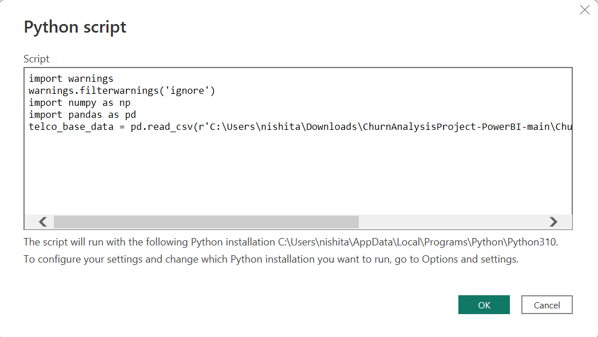

Fig. 1. Python script to get the prediction model

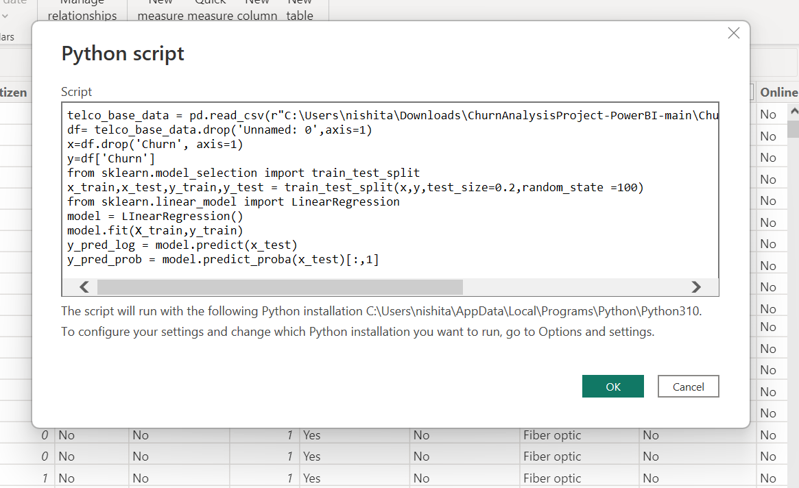

Fig. 2. Applying machine learning models to generate predictor variable

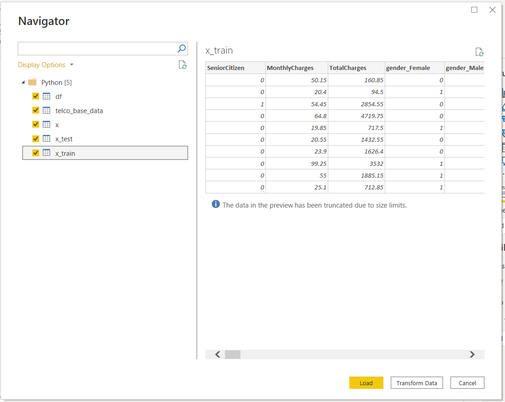

Fig. 3. This is the prediction data Loaded using Python

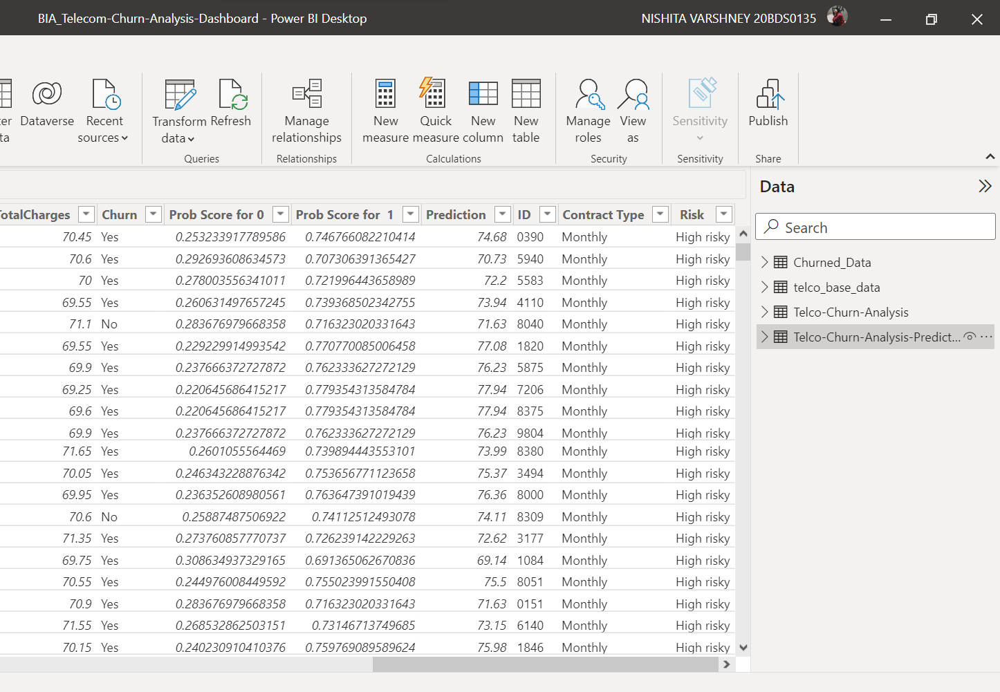

Fig. 4. Using Power Query Editor to merge the variables of the original dataset with prediction values and creating new Prediction Probability variables.

In order to get the Risk variable that we are trying to predict
- If Probability of churn less than 40% then non risky,
-	Between 40% to 60% : Low Risky,
-	60% to 80%: Risky,
-	Greater than 80%: High risky

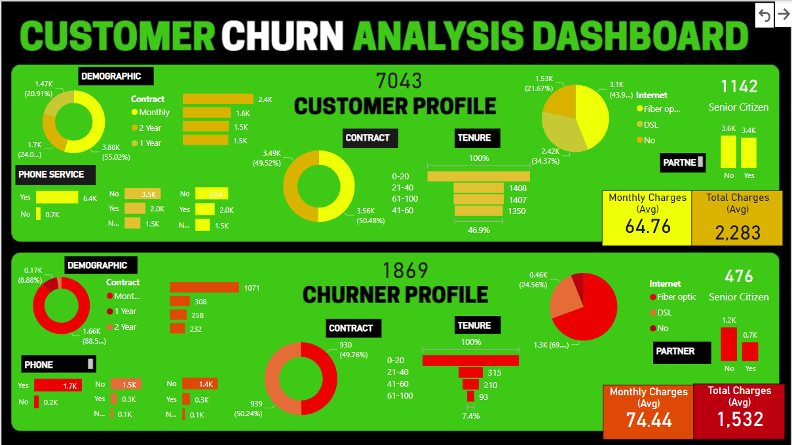

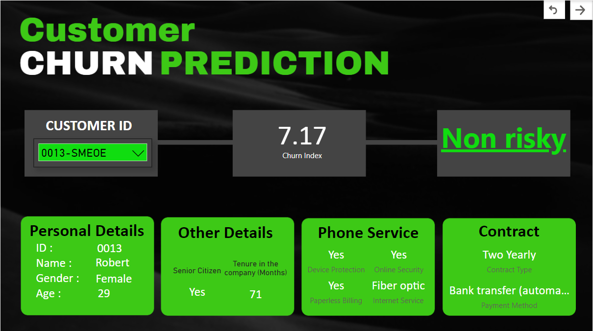

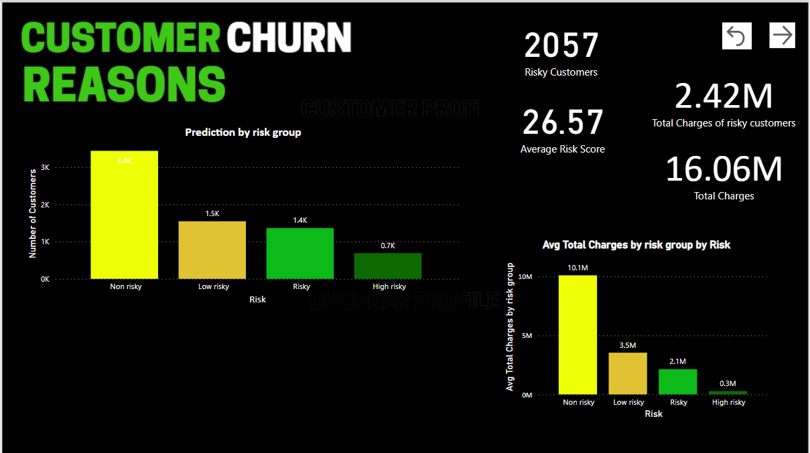

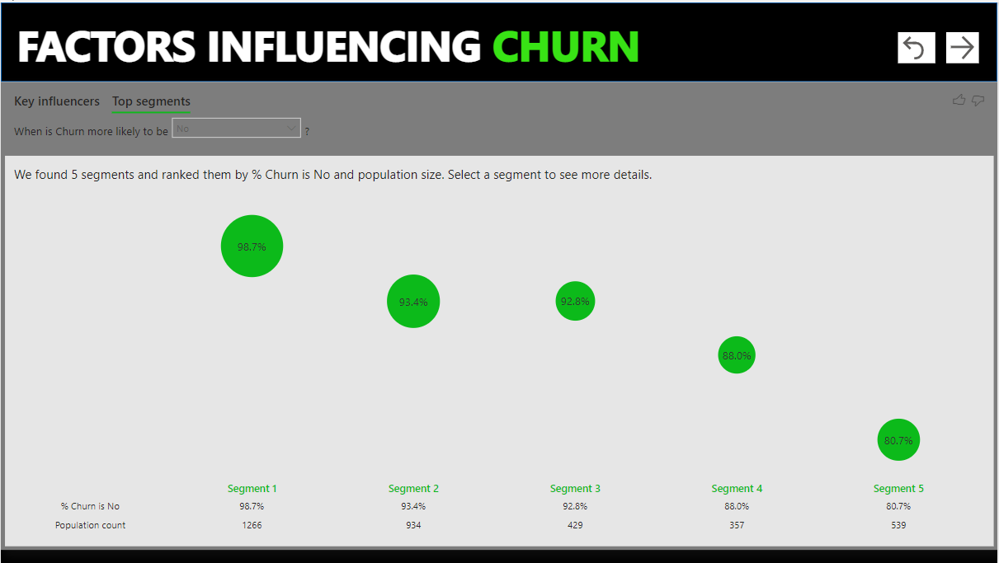

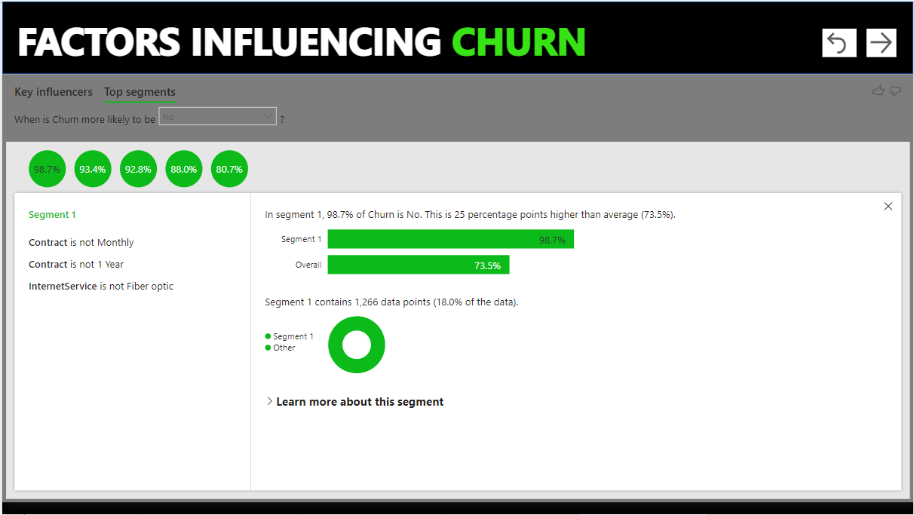

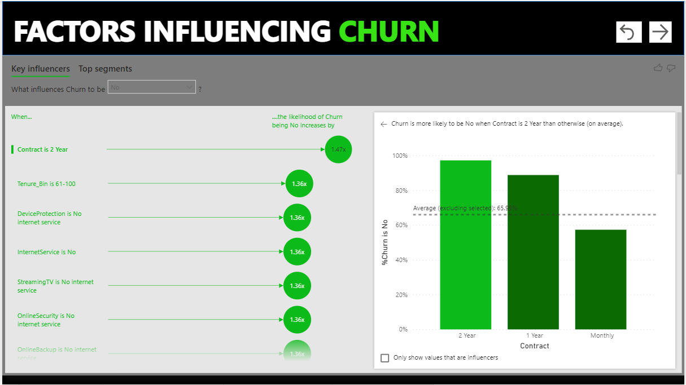

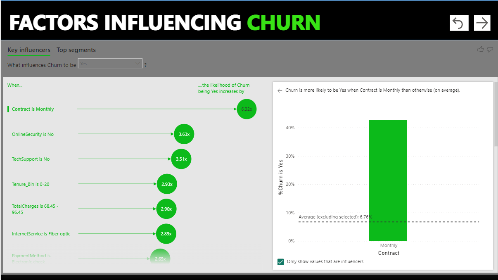
